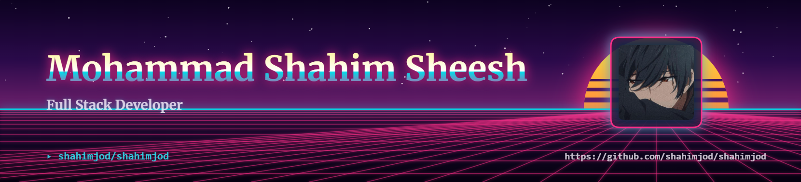

  <picture>
    <source media="(prefers-color-scheme: dark)" srcset="art/header-dark.png">
    
  </picture>

  

  
  
  

---

<h2 align="center">👨‍💻 About Me</h2>

<table align="center">
<tr>
<td width="65%" valign="top">

Hello! I'm <b>Mahammad Shahim Sheesh</b>, an <b>AI & Data Science</b> Engineer who enjoys turning ideas into practical intelligent products. My focus is on <b>Generative AI, RAG pipelines, LLM applications, Machine Learning and Deep Learning</b>.

- 🤖 Building with <b>LangChain, LangGraph, Gemini, OpenAI APIs, RAG and agentic workflows</b>
- 🐍 Working mainly with <b>Python</b>, while building applications with <b>Java, Spring and Spring Boot</b>
- 🔎 Exploring <b>NLP, embeddings, vector databases, predictive modeling and AI systems</b>
- ☁️ Experimenting with <b>IBM Cloud, Azure, Docker, Flask and FastAPI</b>
- 🎯 I like building end-to-end solutions: <b>data → model → API → application → deployment</b>
- 🎓 B.E. in <b>Artificial Intelligence & Data Science</b> | CGPA <b>8.83/10</b>

> <i>"Build useful things. Learn from every iteration. Keep moving forward."</i>

</td>
<td width="35%" align="center" valign="middle">
  
</td>
</tr>
</table>

---

# 💻 Tech Stack:

                                

---

# 📊 GitHub Stats:
 
 

---

<h2 align="center">📈 GitHub Activity</h2>

  

---

## 🏆 GitHub Trophies

---

<h2 align="center">🐍 Contribution Graph</h2>

  <picture>
    <source media="(prefers-color-scheme: dark)" srcset="https://raw.githubusercontent.com/shahimjod/shahimjod/output/github-contribution-grid-snake-dark.svg">
    <source media="(prefers-color-scheme: light)" srcset="https://raw.githubusercontent.com/shahimjod/shahimjod/output/github-contribution-grid-snake.svg">
    
  </picture>

---

<h2 align="center">🌐 Let's Connect</h2>

  
  
  
  

---

  

  

